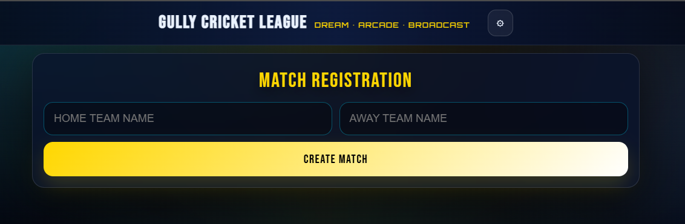
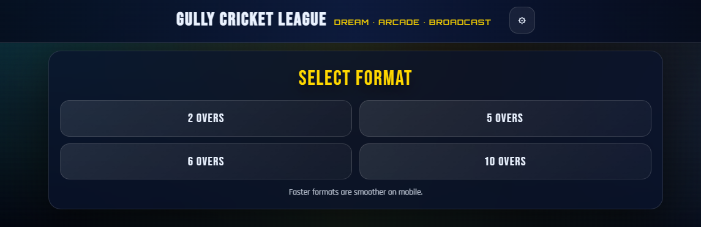
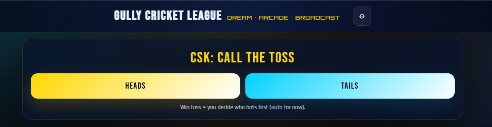
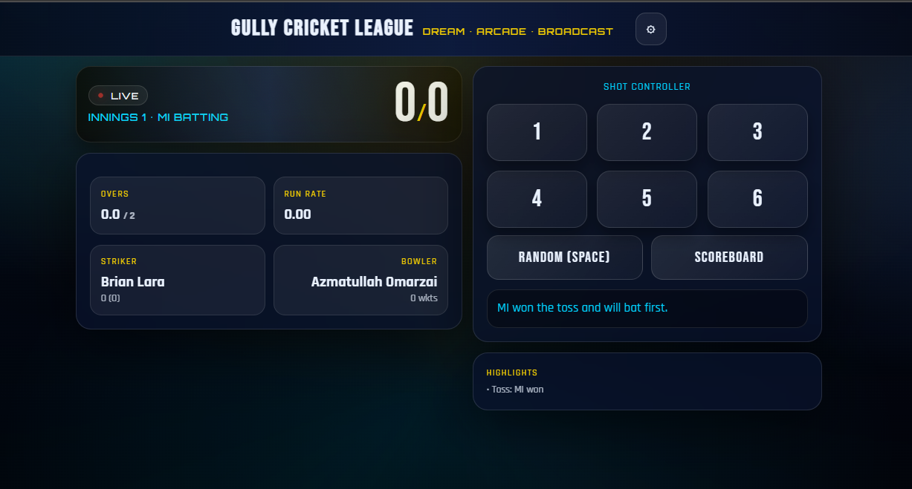
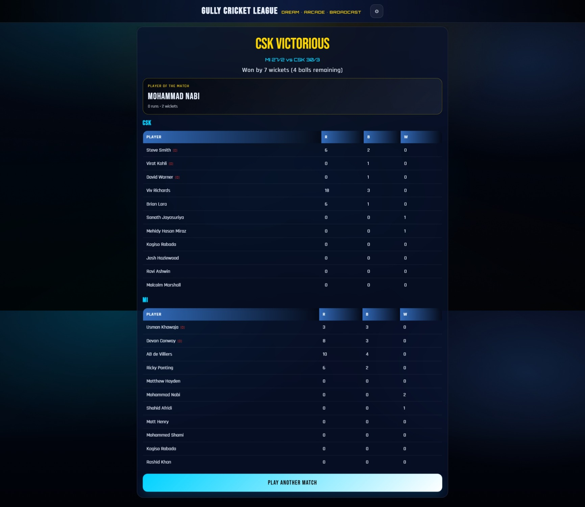

# Gully Cricket League – Web Game

An interactive browser-based cricket match simulator built using pure HTML, CSS, and JavaScript.

This project features a dynamic innings system, live scoreboard, toss logic, player database, and arcade-style shot controller with animated UI.

## Features
- Toss system with automatic batting decision
- Multiple match formats (2, 5, 6, 10 overs)
- Live score updates (Runs/Wickets/Overs)
- Dynamic run rate & required run rate calculation
- AI-based opponent logic
- Player statistics tracking
- End-of-match summary with Player of the Match
- Theme customization
- Lightweight performance-friendly animations

## Tech Stack
- HTML
- CSS (Glassmorphism + Stadium UI)
- Vanilla JavaScript (Game Logic & State Management)

## Preview

---

**Author:** Chinmay Prakash Rout